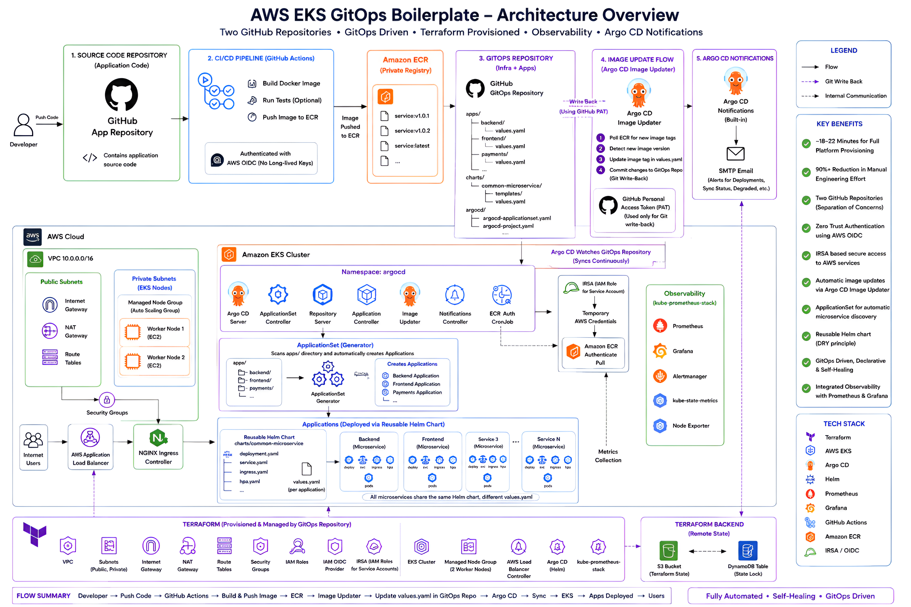
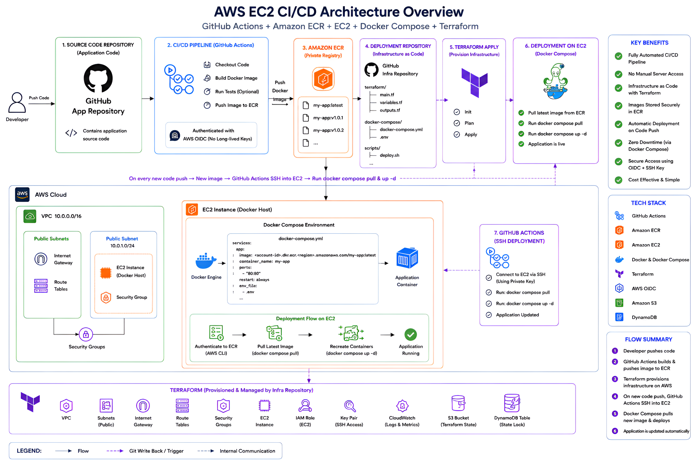

# 🌌 AWS Infra GitOps Boilerplate

<p>
  
  
  
  
  
  
  
  
  
  
  
</p>

## 📖 Project Overview & Vision
This repository is an **open-source, globally reusable GitOps and Infrastructure-as-Code (IaC) boilerplate template**. It is designed to act as a launchpad for DevOps and Platform Engineers who want to bootstrap a production-grade AWS EKS environment with a fully automated, keyless CI/CD pipeline and an Argo CD GitOps engine.

Initially built to solve the operational friction of managing distributed microservices, this repository centralizes infrastructure definition (Terraform) and Kubernetes orchestration into a single, highly governed monorepo. It serves as both a demonstration of advanced Zero-Trust DevOps practices and a plug-and-play template for modern cloud-native deployments.

## 🗺️ Visual Architecture

### 1. Global Platform Workflow (EKS + GitOps)


### 2. Legacy Workload Support (EC2)


## 🛠️ Technology Stack & Justification

Every tool in this boilerplate was carefully selected to fulfill a specific, enterprise-grade requirement:

*   **Amazon EKS (Elastic Kubernetes Service):** Provides a highly available, managed Kubernetes control plane. Chosen over self-hosted Kubernetes to reduce operational overhead while maintaining deep AWS integration.
*   **Amazon EC2 (Elastic Compute Cloud):** Retained alongside EKS to support legacy applications, databases, or stateful workloads that have not yet been containerized or require raw compute access.
*   **HashiCorp Terraform:** The industry standard for Infrastructure-as-Code. Used to declaratively define the AWS network and compute layers, ensuring the infrastructure is reproducible and immutable.
*   **Amazon S3 & DynamoDB:** Used together to provide highly available remote state storage for Terraform. S3 securely stores the `.tfstate` files, while DynamoDB provides state locking to prevent concurrent CI/CD pipelines from corrupting the infrastructure.
*   **GitHub Actions:** Chosen for continuous integration due to its native OIDC integration with AWS. This allows pipelines to securely authenticate with AWS dynamically, eliminating the need for hardcoded, long-lived access keys.
*   **Argo CD:** The core GitOps deployment engine. Selected because it automatically pulls configurations from Git (rather than pushing to the cluster), ensuring the Git repository is the absolute single source of truth for the live cluster state.
*   **Helm:** Used as the Kubernetes package manager. Helm's templating engine allows us to create a DRY (Don't Repeat Yourself) blueprint for microservices, reducing 500+ lines of raw Kubernetes YAML into a simple 20-line `values.yaml` file per app.
*   **Prometheus & Grafana:** The industry standard for cloud-native observability. Prometheus scrapes deep metrics from the EKS nodes and pods, while Grafana visualizes this data into actionable health and performance dashboards.

## ✨ Key Features

This boilerplate is not just a collection of scripts; it is a fully integrated, production-ready DevOps ecosystem.

### 🏗️ Infrastructure as Code (Terraform)
*   **Declarative Environments:** Physical AWS compute, networking (VPCs, Subnets, Gateways), and IAM roles are strictly managed via Terraform.
*   **Dual Compute Support:** Built-in modules for both modern Kubernetes orchestration (`terraform-eks`) and legacy/standalone instances (`terraform-ec2`).
*   **Remote State & Locking:** Prevents infrastructure corruption with S3 backend storage and DynamoDB state locking.

### 🔄 GitOps & Continuous Deployment (Argo CD)
*   **App-of-Apps Architecture:** The entire cluster state is defined by a single root Helm chart (`gitops-control-plane`), making disaster recovery instant.
*   **Dynamic ApplicationSets:** Argo CD automatically discovers new microservices placed in the `apps/` directory and deploys them using a DRY Helm blueprint without manual intervention.
*   **Automated Image Rollouts:** The Argo CD Image Updater securely polls AWS ECR for new Docker tags and pushes Git commits back to this repository, ensuring the infrastructure documents its own release history.

### 🔒 Zero-Trust Security & Identity
*   **Keyless CI/CD (OIDC):** GitHub Actions utilizes AWS OIDC (OpenID Connect) to dynamically assume temporary roles. No hardcoded AWS Access Keys are used in the CI/CD pipeline.
*   **Native AWS ECR Authentication (IRSA):** Implements a highly secure, Kubernetes-native CronJob architecture using IAM Roles for Service Accounts (IRSA) to seamlessly rotate ECR credentials every 8 hours.
*   **Least Privilege IAM:** Strict IAM boundaries isolate the EKS cluster's permissions from the EC2 legacy environments.

### 📊 Day-2 Operations & Observability
*   **Prometheus & Grafana:** Pre-configured monitoring stack for deep cluster metrics, health checks, and performance dashboards out-of-the-box.
*   **Active Alerting (SMTP):** Configured with Argo CD SMTP bindings to instantly alert your engineering team (via Email or Slack) whenever a deployment succeeds, fails, or degrades.
*   **AWS Load Balancer Controller:** Seamless Layer 4 (NLB) and Layer 7 (ALB) traffic routing natively integrated with Kubernetes Ingress.

### 🧩 Developer Experience (DX) & Automation
*   **1-Click Bootstrapping:** Includes a custom bash script (`bootstrap-template.sh`) to instantly inject your personal AWS IDs, Project Names, and GitHub URLs across the entire codebase.
*   **CI/CD Validation:** GitHub Actions automatically runs `terraform plan` on Pull Requests and comments the execution plan directly onto the PR for review.

## ⚡ The Power of Automation (Manual vs. Terraform)

If a team were to provision this entire architecture manually by clicking through the AWS Console and running sequential `kubectl` / `helm` commands, it would take half a day (**5 to 8 hours**). This includes:

*   **VPC & Networking:** Subnets, NAT Gateways, IGW, and precise Route Tables (~45–75 mins).
*   **EKS & Node Groups:** Control plane and managed node group provisioning (~45–60 mins).
*   **Ingress & Routing:** NGINX ingress and AWS ALB Controller with complex IAM/IRSA setups (~60–80 mins).
*   **Observability:** Kube-Prometheus-Stack, Grafana, and Metrics Server (~45–75 mins).
*   **GitOps:** Argo CD installation, SMTP secrets, and Application sync (~30–40 mins).

By utilizing Terraform and Argo CD automation, this project achieves a **90%+ reduction in deployment time**:

*   **Day One Bootstrapping:** The entire platform goes from zero to fully operational in **~18 to 22 minutes** (which is entirely passive waiting on the AWS API to provision nodes).
*   **Zero-Effort Replication:** Over the lifecycle of the project, spinning up an identical "Staging" or "Disaster Recovery" environment requires **0 minutes of engineering effort** and simply 18 minutes of automated cloud provisioning.
*   **Instant Microservice Onboarding:** Adding a new microservice is as simple as copying the `apps/example-microservice/` folder, changing the image name in `values.yaml`, and pushing to Git. Argo CD handles the rest instantly. 
*   **Automated Teardown:** Completely destroying the entire AWS architecture, including all VPCs, Load Balancers, and EKS nodes takes only **10-15 minutes** natively via Terraform, leaving zero orphaned resources.
*   **Error Elimination:** Manual deployments introduce massive risk. A single mistyped subnet tag (`kubernetes.io/role/elb=1`), a missing security group rule, or a misconfigured OIDC trust policy can result in days of debugging. Terraform enforces immutable, error-free infrastructure every single run.

## 📚 Documentation Directory

To make this repository easy to navigate and reuse, the documentation has been distributed into focused manuals:

*   🚀 **[Setup Guide](docs/SETUP_GUIDE.md):** The comprehensive, step-by-step manual for provisioning the AWS infrastructure and bootstrapping the GitOps engine from scratch.
*   🧠 **[Architecture Deep Dive](docs/ARCHITECTURE.md):** An in-depth exploration of the system design, including OIDC trust policies, ApplicationSet configurations, and networking boundaries.
*   🧬 **[Reusability Guide (Forking)](docs/REUSABILITY_GUIDE.md):** A checklist of exactly which hardcoded values (AWS IDs, S3 buckets) must be changed if you intend to clone this template for a new project.
*   🛠️ **[Troubleshooting Runbook](docs/TROUBLESHOOTING.md):** Operational guides for resolving common platform failures (e.g., Terraform deadlocks, Argo CD OutOfSync errors).

## 🛠️ How to Use This Template

If you have forked or cloned this repository to start your own platform, you must inject your specific environments, names, and AWS IDs into the codebase. We have sanitized all hardcoded values into standard placeholders.

To make this frictionless, we have provided an automated bootstrap script.

1. **Edit the Script**: Open `bootstrap-template.sh` in the root of the repository and update the variables at the top of the file with your specific credentials:
   ```bash
   export PROJECT_NAME="my-awesome-app"
   export AWS_ACCOUNT_ID="123456789012"
   ...
   ```
2. **Run the Script**: Execute the script in your terminal to automatically hydrate the boilerplate across all files:
   ```bash
   ./bootstrap-template.sh
   ```
3. **Enable CI/CD**: Open `.github/workflows/terraform-cicd.yaml` and uncomment the `push:` and `pull_request:` triggers to activate your deployment pipeline.

> **Important Note:** You must also manually replace `my-project-terraform-state-bucket`, `my-project-terraform-lock-table`, and `my-eks-cluster` with your own unique names inside the Terraform files to avoid AWS state collisions. See the **[Reusability Guide](docs/REUSABILITY_GUIDE.md)** for the full checklist!

## 🗺️ Future Roadmap

While the current platform fully automates infrastructure and application delivery, I am actively planning the following enterprise upgrades:

*   **Automated Secret Management:** Integrating **External Secrets Operator (ESO)** with AWS Secrets Manager. This will eliminate the need to manually create Kubernetes Secrets for database connection strings and API keys, pulling them dynamically via IRSA.
*   **Service Mesh Integration:** Evaluating Istio or Linkerd to handle mutual TLS (mTLS) and advanced traffic routing between microservices.
*   **EKS Auto Mode Migration:** Transitioning to EKS Auto Mode for true serverless compute management. This will completely abstract away node group provisioning, auto-scaling, and OS patching, further simplifying the Terraform footprint while drastically optimizing AWS compute costs.

---
<div align="center">
  <b>Maintained by Parth Singh Kushwaha</b>
</div>
